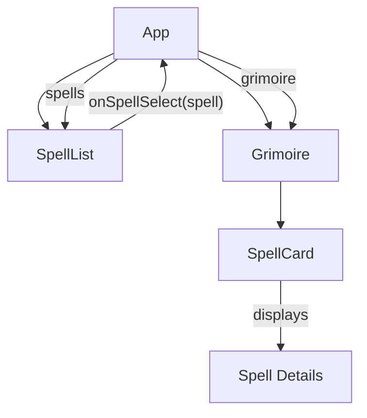

# System Patterns: D&D 5e Grimoire Builder

## System Architecture

The D&D 5e Grimoire Builder follows a client-side single-page application (SPA) architecture built with React and TypeScript. The application has a simple but effective structure:

```
dnd-grimoire/
├── public/           # Static assets and HTML entry point
└── src/              # Source code
    ├── App.tsx       # Main application component
    ├── SpellList.tsx # Component for displaying and searching spells
    ├── Grimoire.tsx  # Component for displaying the grimoire
    ├── SpellCard.tsx # Component for displaying a single spell
    ├── types.ts      # TypeScript interfaces
    └── ...           # Other React boilerplate files
```

## Key Technical Decisions

1. **React Framework**: Chosen for its component-based architecture, which aligns well with the UI elements needed for this application.

2. **TypeScript**: Used to provide type safety and better developer experience, particularly important for handling the complex spell data structures.

3. **External API Integration**: The application fetches spell data from the D&D 5e API (https://www.dnd5eapi.co/api) rather than maintaining its own database, reducing maintenance overhead.

4. **Client-Side Only**: The application runs entirely in the browser without a backend, simplifying deployment and reducing infrastructure needs.

5. **Functional Components with Hooks**: Modern React patterns are used throughout the application for state management and side effects.

## Design Patterns in Use

1. **Component Composition**: The UI is broken down into reusable components (SpellList, Grimoire, SpellCard) that are composed together in the main App component.

2. **Container/Presentational Pattern**:

   - Container components (App) handle data fetching and state management
   - Presentational components (SpellCard) focus on rendering UI based on props

3. **Controlled Components**: Form elements like the search input are implemented as controlled components, with their state managed by React.

4. **Lifting State Up**: The spell selection state is managed in the App component and passed down to child components as props.

5. **Conditional Rendering**: Components use conditional rendering to display different UI elements based on data properties (e.g., showing material components only if they exist).

## Component Relationships



1. **App Component**: The root component that:

   - Manages application state (spells list and grimoire)
   - Fetches data from the D&D 5e API
   - Handles spell selection logic
   - Renders the SpellList and Grimoire components

2. **SpellList Component**:

   - Receives the list of spells as props
   - Implements search functionality
   - Calls the onSpellSelect callback when a spell is clicked

3. **Grimoire Component**:

   - Receives the grimoire (array of selected spells) as props
   - Renders a SpellCard for each spell in the grimoire

4. **SpellCard Component**:
   - Receives a single spell as props
   - Renders the detailed spell information

## Critical Implementation Paths

1. **Spell Data Fetching**:

   ```
   App.tsx (useEffect) → Fetch spell list → Set spells state
   ```

2. **Spell Selection**:

   ```
   SpellList (spell click) → onSpellSelect callback →
   App.tsx (handleSpellSelect) → Fetch spell details →
   Update grimoire state
   ```

3. **Search Functionality**:

   ```
   SpellList (search input) → Update searchTerm state →
   Filter spells array → Render filtered results
   ```

4. **Grimoire Rendering**:

   ```
   App.tsx → Pass grimoire to Grimoire component →
   Grimoire maps over spells → Render SpellCard for each spell
   ```

5. **Print Functionality**:
   ```
   App.tsx (print button) → window.print() → Browser print dialog
   ```

## Data Flow

1. **Spell List Data**:

   - Fetched from `${BASE_API}/spells` endpoint
   - Transformed into an array of Spell objects
   - Stored in the `spells` state in App component
   - Passed to SpellList component as props

2. **Spell Details Data**:
   - Fetched from `${BASE_API}/spells/${spell.index}` endpoint when a spell is selected
   - Transformed into a GrimoireSpell object
   - Added to the `grimoire` state array in App component
   - Passed to Grimoire component as props
   - Distributed to individual SpellCard components

This architecture provides a clean separation of concerns while maintaining a simple data flow that is easy to understand and maintain.
