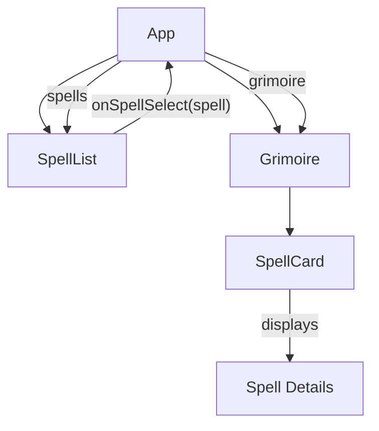

# System Patterns: D&D 5e Grimoire Builder

## System Architecture

The D&D 5e Grimoire Builder follows a client-side single-page application (SPA) architecture built with React and TypeScript. The application has a simple but effective structure:

```
dnd-grimoire/
├── public/            # Static assets and HTML entry point
└── src/               # Source code
    ├── App.tsx        # Main application component
    ├── App.css        # Global styles and design system
    ├── types.ts       # TypeScript interfaces and types
    ├── components/    # UI components
    │   ├── index.ts   # Component exports
    │   ├── SpellList.tsx # Search and filter spell component
    │   ├── Grimoire.tsx  # Grimoire display component
    │   ├── SpellCard.tsx # Individual spell component
    │   └── GrimoireNameModal.tsx # Modal for naming grimoires
    ├── utils/         # Utility functions
    │   ├── index.ts   # Util exports
    │   ├── api.ts     # API-related functions
    │   ├── cache.ts   # Caching utilities
    │   ├── storage.ts # Local storage management
    │   └── pdf.ts     # PDF generation
    └── ...            # Other React boilerplate files
```

## Key Technical Decisions

1. **React Framework**: Chosen for its component-based architecture, which aligns well with the UI elements needed for this application.

## UI Component Patterns

### Modal Dialog Pattern

The application uses a reusable modal dialog pattern for user interactions that require focused input:

```tsx
// GrimoireNameModal.tsx
interface GrimoireNameModalProps {
  isOpen: boolean;
  onClose: () => void;
  onSave: (name: string) => void;
  initialName?: string;
  title: string;
  saveLabel?: string;
}

export const GrimoireNameModal: React.FC<GrimoireNameModalProps> = ({
  isOpen,
  onClose,
  onSave,
  initialName = '',
  title,
  saveLabel = 'Save',
}) => {
  // Modal implementation
};
```

The modal component is designed to be reusable for different contexts:

- Creating new grimoires (empty initial name)
- Renaming existing grimoires (prepopulated with current name)
- Customizable title and button labels

### Filter and Search Pattern

The application uses a consistent pattern for filtering and searching data:

1. **State Management**: Using React useState for filter criteria
2. **Memoized Filtering**: Using useMemo for performance optimization
3. **Controlled Components**: Form elements as controlled components
4. **Clear Actions**: Providing intuitive ways to clear filters
5. **Visual Feedback**: Showing count of filtered results

6. **TypeScript**: Used to provide type safety and better developer experience, particularly important for handling the complex spell data structures.

7. **External API Integration**: The application fetches spell data from the D&D 5e API (https://www.dnd5eapi.co/api) rather than maintaining its own database, reducing maintenance overhead.

8. **Client-Side Only**: The application runs entirely in the browser without a backend, simplifying deployment and reducing infrastructure needs.

9. **Functional Components with Hooks**: Modern React patterns are used throughout the application for state management and side effects.

## Design Patterns in Use

1. **Component Composition**: The UI is broken down into reusable components (SpellList, Grimoire, SpellCard) that are composed together in the main App component.

2. **Container/Presentational Pattern**:

   - Container components (App) handle data fetching and state management
   - Presentational components (SpellCard) focus on rendering UI based on props

3. **Controlled Components**: Form elements like the search input are implemented as controlled components, with their state managed by React.

4. **Lifting State Up**: The spell selection state is managed in the App component and passed down to child components as props.

5. **Conditional Rendering**: Components use conditional rendering to display different UI elements based on data properties (e.g., showing material components only if they exist).

## Component Relationships



1. **App Component**: The root component that:

   - Manages application state (spells list and grimoire)
   - Fetches data from the D&D 5e API
   - Handles spell selection logic
   - Renders the SpellList and Grimoire components

2. **SpellList Component**:

   - Receives the list of spells as props
   - Implements search functionality
   - Calls the onSpellSelect callback when a spell is clicked

3. **Grimoire Component**:

   - Receives the grimoire (array of selected spells) as props
   - Renders a SpellCard for each spell in the grimoire

4. **SpellCard Component**:
   - Receives a single spell as props
   - Renders the detailed spell information

## Critical Implementation Paths

1. **Spell Data Fetching**:

   ```
   App.tsx (useEffect) → Fetch spell list → Set spells state
   ```

2. **Spell Selection**:

   ```
   SpellList (spell click) → onSpellSelect callback →
   App.tsx (handleSpellSelect) → Fetch spell details →
   Update grimoire state
   ```

3. **Search Functionality**:

   ```
   SpellList (search input) → Update searchTerm state →
   Filter spells array → Render filtered results
   ```

4. **Grimoire Rendering**:

   ```
   App.tsx → Pass grimoire to Grimoire component →
   Grimoire maps over spells → Render SpellCard for each spell
   ```

5. **Print Functionality**:
   ```
   App.tsx (print button) → window.print() → Browser print dialog
   ```

## Data Flow

1. **Spell List Data**:

   - Fetched from `${BASE_API}/spells` endpoint
   - Transformed into an array of Spell objects
   - Stored in the `spells` state in App component
   - Passed to SpellList component as props

2. **Spell Details Data**:
   - Fetched from `${BASE_API}/spells/${spell.index}` endpoint when a spell is selected
   - Transformed into a GrimoireSpell object
   - Added to the `grimoire` state array in App component
   - Passed to Grimoire component as props
   - Distributed to individual SpellCard components

This architecture provides a clean separation of concerns while maintaining a simple data flow that is easy to understand and maintain.

## API Management Patterns

### Rate Limiting Protection

The application implements several patterns to handle API rate limiting:

1. **Smart Caching System**:

   ```typescript
   // Cache with expiration
   interface CacheItem<T> {
     value: T;
     timestamp: number; // Time when cached
     expiry: number; // Expiration time in ms
   }

   // Reading from cache with expiration check
   export const getCachedItem = <T>(key: string): T | null => {
     const item = localStorage.getItem(key);
     if (!item) return null;

     const cacheItem: CacheItem<T> = JSON.parse(item);
     const now = Date.now();

     // Return null if expired
     if (now > cacheItem.timestamp + cacheItem.expiry) {
       localStorage.removeItem(key);
       return null;
     }

     return cacheItem.value;
   };
   ```

2. **Request Batching**:

   ```typescript
   // Batch processing with concurrency control
   export const batchFetchApiData = async <T>(
     endpoints: string[],
     concurrency = 3 // Control maximum parallel requests
   ): Promise<T[]> => {
     const results: T[] = [];
     let index = 0;

     // Process in batches to control concurrency
     const processBatch = async () => {
       const currentIndex = index++;
       if (currentIndex >= endpoints.length) return;

       try {
         const data = await fetchApiData<T>(endpoints[currentIndex]);
         results[currentIndex] = data;
       } catch (error) {
         console.error(`Error fetching ${endpoints[currentIndex]}:`, error);
       }

       // Process next batch
       await processBatch();
     };

     // Start N concurrent batches
     await Promise.all(
       Array(concurrency)
         .fill(null)
         .map(() => processBatch())
     );
     return results;
   };
   ```

3. **Exponential Backoff Retry**:

   ```typescript
   // Retry with exponential backoff
   const fetchWithRetry = async <T>(
     url: string,
     retries = 3,
     delay = 1000
   ): Promise<T> => {
     try {
       const response = await fetch(url);

       // Handle rate limiting
       if (response.status === 429) {
         if (retries > 0) {
           // Wait with exponential backoff
           await new Promise((resolve) => setTimeout(resolve, delay));
           // Retry with increased delay
           return fetchWithRetry<T>(url, retries - 1, delay * 2);
         }
       }

       // Handle other responses
       return await response.json();
     } catch (error) {
       if (retries > 0) {
         await new Promise((resolve) => setTimeout(resolve, delay));
         return fetchWithRetry<T>(url, retries - 1, delay * 2);
       }
       throw error;
     }
   };
   ```

4. **Progressive Loading Pattern**:

   ```typescript
   // Progressive loading with callback
   export const fetchSpellList = async (
     onFullDetailsLoaded?: (fullSpells: Spell[]) => void
   ): Promise<Spell[]> => {
     // First fetch basic spell list (lightweight)
     const spellList = await fetchApiData<SpellListResponse>(
       ENDPOINTS.SPELL_LIST
     );

     // Return basic data immediately for UI rendering
     const basicSpells = spellList.results.map((spell) => ({
       index: spell.index,
       name: spell.name,
       url: spell.url,
       // Default values for required properties
       level: 0,
       school: { name: 'Unknown', index: 'unknown', url: '' },
     }));

     // Then fetch full details in background
     batchFetchApiData<Spell>(spellList.results.map((spell) => spell.url)).then(
       (fullSpells) => {
         // Callback with complete data when available
         if (onFullDetailsLoaded) {
           onFullDetailsLoaded(fullSpells);
         }
       }
     );

     return basicSpells;
   };
   ```

5. **In-Flight Request Tracking**:

   ```typescript
   // Track in-flight requests to prevent duplicates
   const inFlightRequests: Record<string, Promise<any>> = {};

   export const fetchApiData = async <T>(endpoint: string): Promise<T> => {
     // Check if request is already in flight
     if (inFlightRequests[endpoint]) {
       return inFlightRequests[endpoint] as Promise<T>;
     }

     // Create and track the new request
     const requestPromise = fetchWithRetry<T>(endpoint);
     inFlightRequests[endpoint] = requestPromise;

     try {
       const result = await requestPromise;
       return result;
     } finally {
       // Remove from tracking when complete
       delete inFlightRequests[endpoint];
     }
   };
   ```
